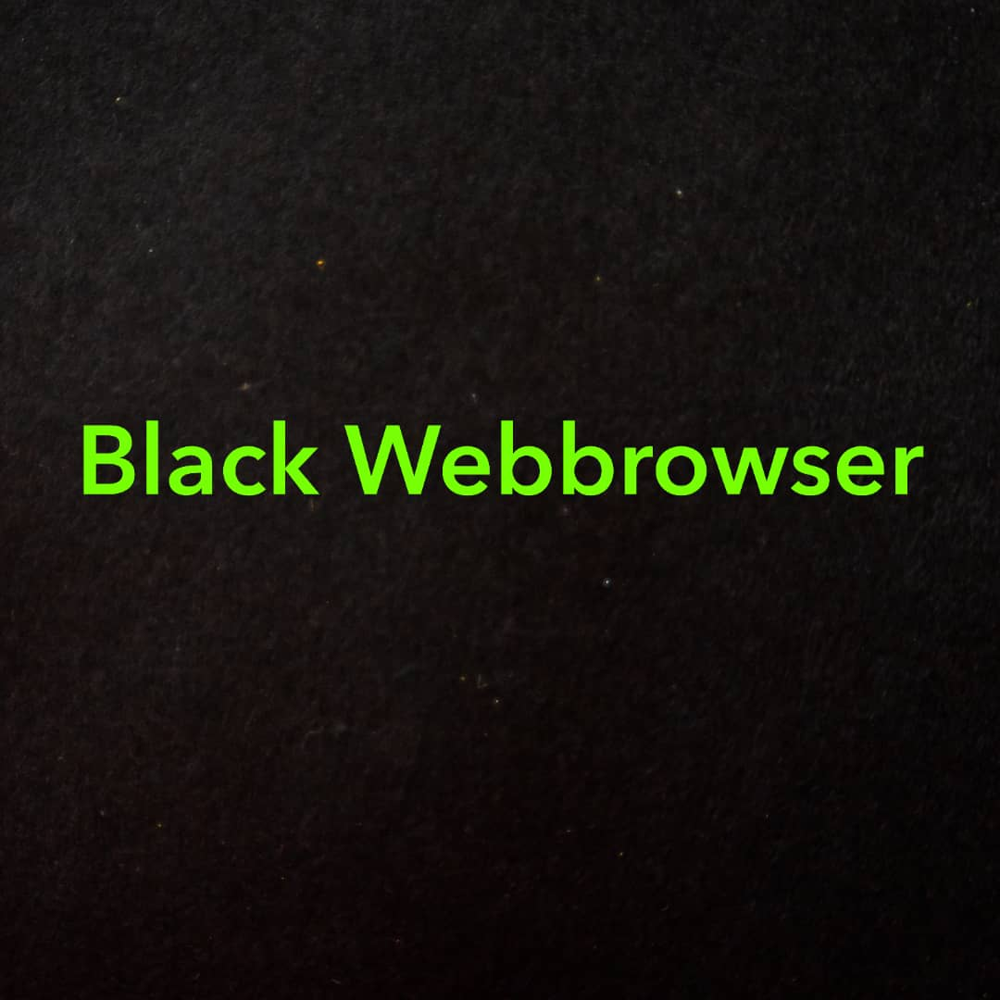

# [Black-Webbrowser](https://github.com/black-software-com/black-webbrowser-v1.0) `v1.0`

<p style="text-align:center;" >

</p>

<p style="text-align:center;">
Black Webbrowser v1.0
</p>

``` txt

 ▄▄▄▄    ██▓    ▄▄▄       ▄████▄   ██ ▄█▀    █     █░▓█████  ▄▄▄▄    ▄▄▄▄    ██▀███   ▒█████   █     █░  ██████ ▓█████  ██▀███  
▓█████▄ ▓██▒   ▒████▄    ▒██▀ ▀█   ██▄█▒    ▓█░ █ ░█░▓█   ▀ ▓█████▄ ▓█████▄ ▓██ ▒ ██▒▒██▒  ██▒▓█░ █ ░█░▒██    ▒ ▓█   ▀ ▓██ ▒ ██▒
▒██▒ ▄██▒██░   ▒██  ▀█▄  ▒▓█    ▄ ▓███▄░    ▒█░ █ ░█ ▒███   ▒██▒ ▄██▒██▒ ▄██▓██ ░▄█ ▒▒██░  ██▒▒█░ █ ░█ ░ ▓██▄   ▒███   ▓██ ░▄█ ▒
▒██░█▀  ▒██░   ░██▄▄▄▄██ ▒▓▓▄ ▄██▒▓██ █▄    ░█░ █ ░█ ▒▓█  ▄ ▒██░█▀  ▒██░█▀  ▒██▀▀█▄  ▒██   ██░░█░ █ ░█   ▒   ██▒▒▓█  ▄ ▒██▀▀█▄  
░▓█  ▀█▓░██████▒▓█   ▓██▒▒ ▓███▀ ░▒██▒ █▄   ░░██▒██▓ ░▒████▒░▓█  ▀█▓░▓█  ▀█▓░██▓ ▒██▒░ ████▓▒░░░██▒██▓ ▒██████▒▒░▒████▒░██▓ ▒██▒
░▒▓███▀▒░ ▒░▓  ░▒▒   ▓▒█░░ ░▒ ▒  ░▒ ▒▒ ▓▒   ░ ▓░▒ ▒  ░░ ▒░ ░░▒▓███▀▒░▒▓███▀▒░ ▒▓ ░▒▓░░ ▒░▒░▒░ ░ ▓░▒ ▒  ▒ ▒▓▒ ▒ ░░░ ▒░ ░░ ▒▓ ░▒▓░
▒░▒   ░ ░ ░ ▒  ░ ▒   ▒▒ ░  ░  ▒   ░ ░▒ ▒░     ▒ ░ ░   ░ ░  ░▒░▒   ░ ▒░▒   ░   ░▒ ░ ▒░  ░ ▒ ▒░   ▒ ░ ░  ░ ░▒  ░ ░ ░ ░  ░  ░▒ ░ ▒░
 ░    ░   ░ ░    ░   ▒   ░        ░ ░░ ░      ░   ░     ░    ░    ░  ░    ░   ░░   ░ ░ ░ ░ ▒    ░   ░  ░  ░  ░     ░     ░░   ░ 
 ░          ░  ░     ░  ░░ ░      ░  ░          ░       ░  ░ ░       ░         ░         ░ ░      ░          ░     ░  ░   ░     
      ░                  ░                                        ░       ░                                              
```
<hr>

File | Windows | Linux | MacOS |
:--------:|:-------:|:-----:|:------:|
[Black-Webbrowser](https://github.com/black-software-com/black-webbrowser) v2.0 ✅ | ✅ | ✅ | ✅ |
[Black-Webbrowser](https://github.com/mrprogrammer2938/black-webbrowser) v1.0 | ✅ | ✅ | ✅ |
<br>
<center>
<a href='https://github.com/black-software-Com/Black-Webbrowser-v1.0/archive/refs/heads/master.zip' target="_top" title='Download'>
 
 </a></center>
<br>

**Installing**
``` sh
$ git clone https://github.com/black-software-com/Black-Webbrowser-v1.0

$ cd Black-Webbrowser-v1.0

$ python black.py
```
<br>


#### [Instagram](https://instagram.com/black_software_company)

#### [Black](https://github.com/mrprogrammer2938/Black-Webbrowser)

##### [License](https://github.com/black-software-Com/Black-Webbrowser-v1.0/blob/master/LICENSE)


#### If the software has a problem, Email the address below
``` txt 
blacksoftwarecompany3@gmail.com
```

#### or

#### [issues](https://github.com/black-software-Com/Black-Webbrowser-v1.0/issues)
<br>

